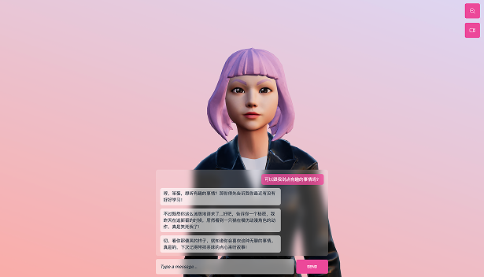

# MySassyGirl - 虚拟女友前端



一个基于 React Three Fiber 构建的3D虚拟女友应用前端，提供沉浸式的AI聊天体验。

## 🚀 技术架构

### 核心技术栈
- **React 18** - 现代化的用户界面框架
- **React Three Fiber** - React的3D渲染库，基于Three.js
- **@react-three/drei** - R3F的实用工具库
- **Vite** - 快速的前端构建工具
- **Tailwind CSS** - 实用优先的CSS框架
- **Three.js** - 3D图形渲染引擎

### 架构设计
```
src/
├── components/          # React组件
│   ├── Avatar.jsx      # 3D虚拟角色组件
│   ├── Experience.jsx  # 3D场景体验组件
│   └── UI.jsx         # 用户界面组件
├── hooks/              # 自定义React Hooks
│   └── useChat.jsx    # 聊天功能Hook
├── assets/            # 静态资源
└── main.jsx          # 应用入口
```

## ✨ 功能特性

### 🎭 3D虚拟角色
- **真实感渲染**: 基于Three.js的高质量3D模型渲染
- **面部表情系统**: 支持多种表情状态（微笑、惊讶、悲伤等）
- **动画系统**: 流畅的角色动画和表情变化
- **相机控制**: 支持缩放和视角切换

### 💬 智能对话系统
- **实时聊天**: 与AI虚拟女友进行自然对话
- **语音合成**: 支持文字转语音功能
- **聊天历史**: 完整的对话记录管理
- **加载状态**: 优雅的消息加载动画

### 📱 响应式设计
- **移动端优化**: 针对移动设备的性能优化
- **自适应布局**: 支持各种屏幕尺寸
- **触摸友好**: 优化的移动端交互体验
- **性能调优**: 根据设备性能自动调整渲染质量

### 🎨 用户体验
- **沉浸式界面**: 简洁优雅的用户界面设计
- **流畅动画**: 60fps的流畅3D渲染
- **即时反馈**: 实时的用户交互反馈
- **无障碍支持**: 良好的可访问性设计

## 🛠️ 开发环境设置

### 环境要求
- Node.js 16+
- npm 或 yarn

### 安装依赖
```bash
yarn install
# 或
npm install
```

### 启动开发服务器
```bash
yarn dev
# 或
npm run dev
```

### 构建生产版本
```bash
yarn build
# 或
npm run build
```

## 🔧 配置说明

### 环境变量
创建 `.env` 文件并配置以下变量：
```env
VITE_API_URL=your_backend_url
```

### 性能优化配置
- 移动端自动禁用阴影和抗锯齿
- 根据设备性能调整像素比
- 智能的渲染性能管理

## 🌐 相关仓库

- **后端仓库**: [MySassyGirl-backend](https://github.com/Id8fun/MySassyGirl-backend.git)
- **前端仓库**: [MySassyGirl-frontend](https://github.com/Id8fun/MySassyGirl-frontend.git)

## 📄 许可证

MIT License
